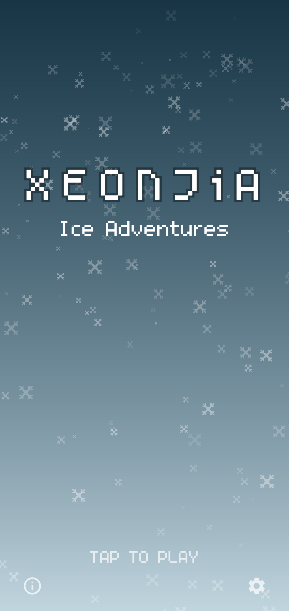
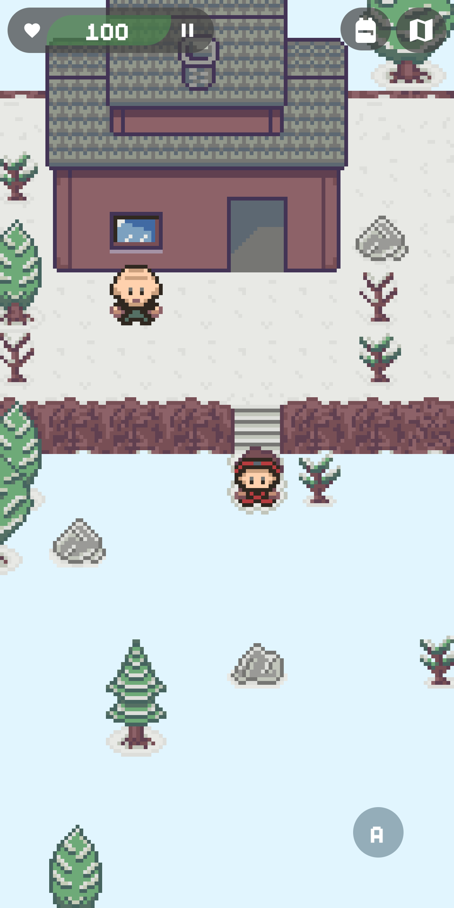
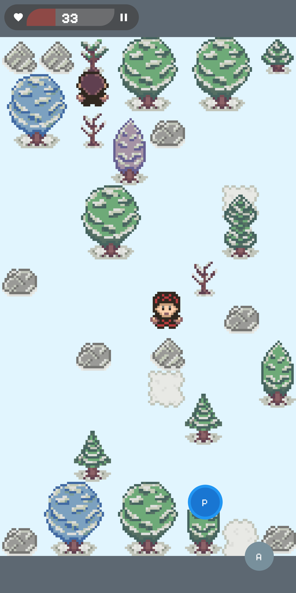
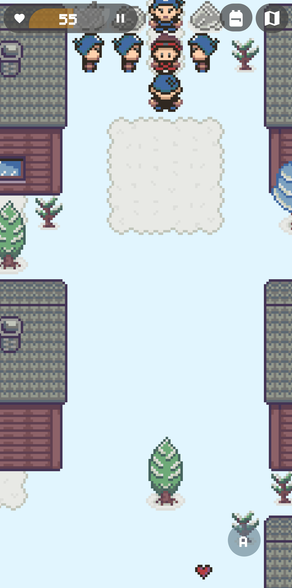

# X E O N J i A

Save the world by solving ice puzzles and defeating enemies.

## About

Xeonjia is an Android game set in a frozen world.

There are two modes:

1) Story mode: the world has been frozen and your duty is to defeat the "King of Evil" and save the
kingdom.

2) Multiplayer mode: defeat enemies, score points and make your team win.

Basically you will have to swipe your finger to move your character across the world.

Keep in mind that you can't stop yourself until you reach a wall, a boulder, or any other type of
obstacle.

Over time, you will gain experience points that will allow you to increase your level and you will
find money and hidden treasures that you can use to buy stuff and improve yourself.

Be careful, the world is full of dangerous enemies ready to attack you!

Use your mind to figure out the best path!

## Screenshots

## Donate

If you want to support the development of Xeonjia you can donate through Liberapay or Ko-fi.

## License

### Code

This software is distributed under the GNU General Public License as published by the Free Software
Foundation, either version 3 of the License, or any later version. See the file LICENSE for the
conditions under which this software is made available. This software also contains code from other
sources.

### Graphics

Except where otherwise noted, all the graphics of this game are licensed under the Creative Commons
Attribution-ShareAlike 4.0 International License
([CC BY-SA 4.0](https://creativecommons.org/licenses/by-sa/4.0/)).

### Music

Except where otherwise noted, all the background music of this game are licensed under the Creative
Commons Attribution-ShareAlike 4.0 International License
([CC BY-SA 4.0](https://creativecommons.org/licenses/by-sa/4.0/)).

The following are adapted artwork from Yubatake and are licensed under the Creative Commons
Attribution 3.0 Unported License ([CC BY 3.0](https://creativecommons.org/licenses/by/3.0/)):
city.oga, enemies.oga, forest.oga, road.oga, town.oga.