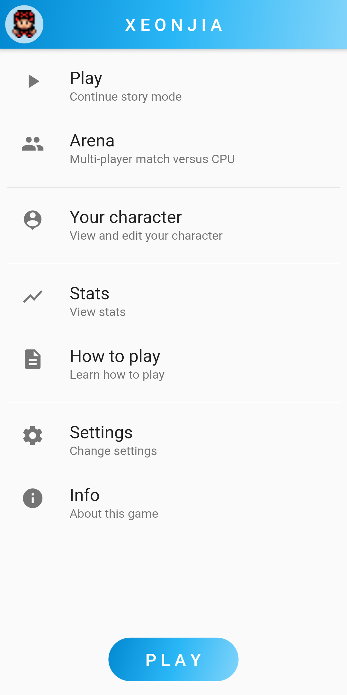
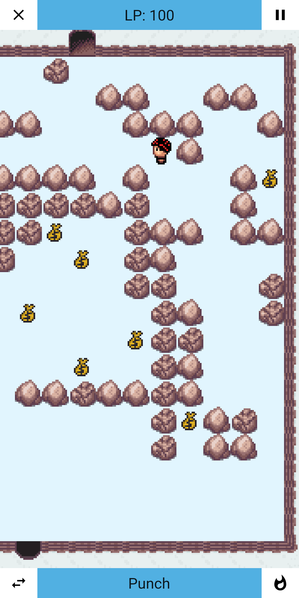
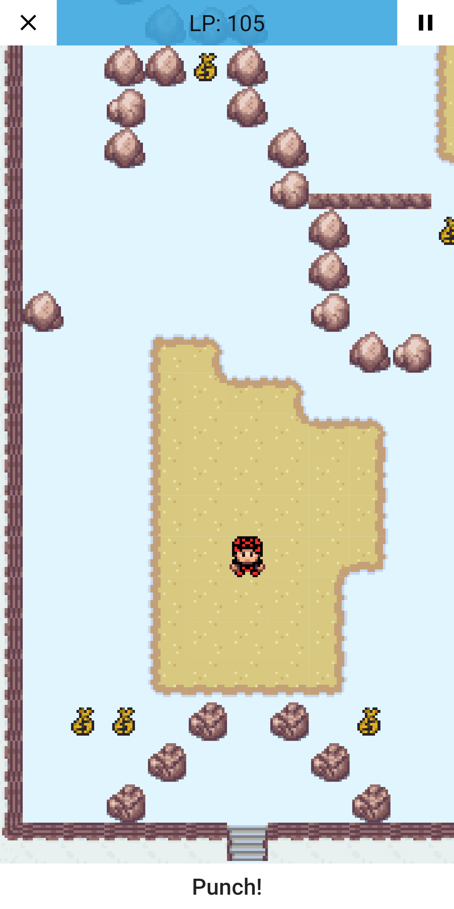
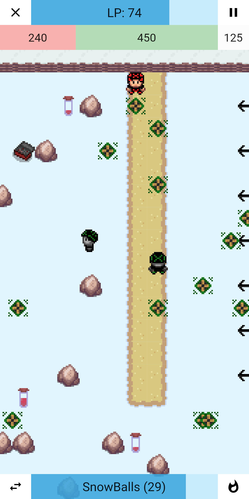

# X E O N J I A

Solve ice puzzles and defeat enemies in an RPG world.

## About

There are two modes:

1) Story mode: the aim is to reach the last floor of the tower and defeat the "King of Evil".

2) Multiplayer mode: the aim of this mode is to score points and make your team win.

Basically you will have to swipe your finger to move your character across the room; keep in mind that you can't stop yourself until you reach a wall or a boulder.

Over time, you will gain experience points that will allow you to increase your level and during your trip you will find money and hidden treasures that you can use to buy stuff and improve yourself.

Be careful, the tower is full of dangerous enemies ready to attack you!

Use your mind to figure out how to find the right path!

## Screenshots

## License

### Code

This software is distributed under the GNU General Public License as published by the Free Software Foundation, either version 3 of the License, or any later version. See the file LICENSE for the conditions under which this software is made available. This software also contains code from other sources.

### Graphics

Except where otherwise noted, all graphics of this game are licensed under the Creative Commons Attribution-ShareAlike 4.0 International License ([CC BY-SA 4.0](https://creativecommons.org/licenses/by-sa/4.0/)).

The following are adapted artwork from [Tuxemon](https://github.com/Tuxemon/Tuxemon) and are licensed under the Creative Commons Attribution-ShareAlike 3.0 Unported License ([CC BY-SA 3.0](https://creativecommons.org/licenses/by-sa/3.0/)):
character-\*.png, door\*.png, ground\*.png, hurdle\*.png, rock\*.png, stairs\*.png, wall\*.png